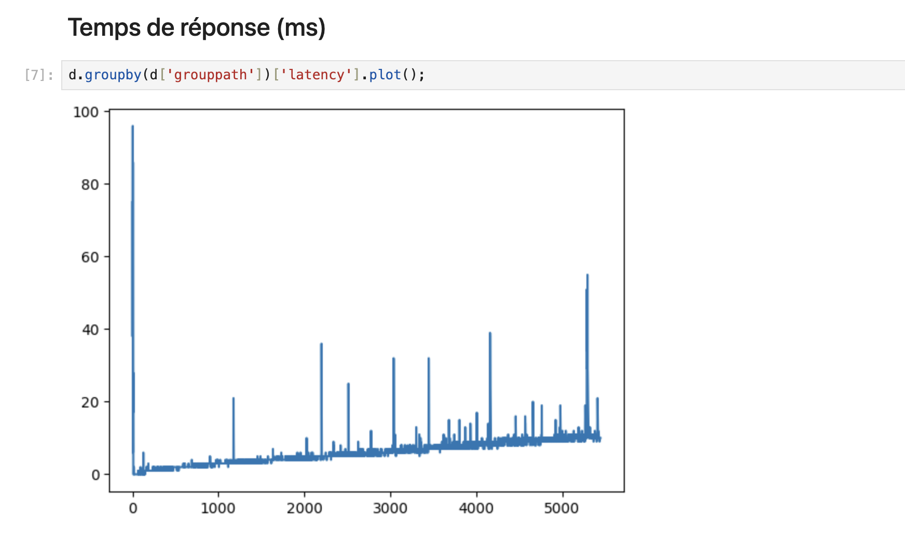
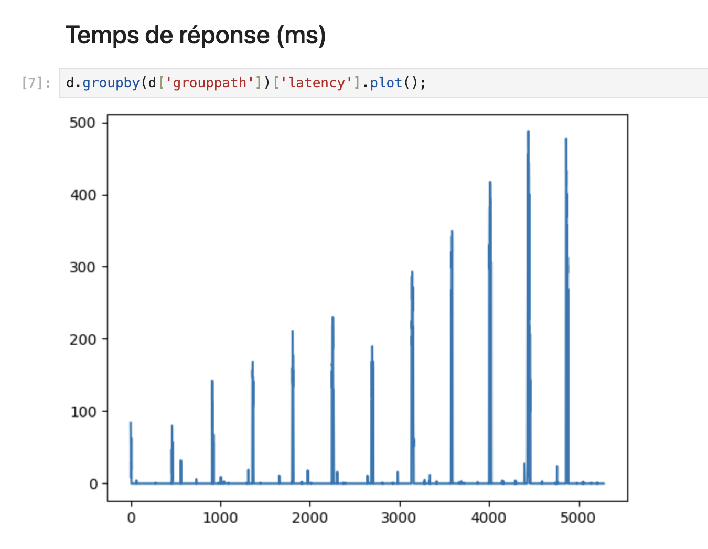

# Homework 4: ImtOrder Statistics to Database Service

## Overview

The **ImtOrder Statistics to Database Service** is a GenServer to manage product statistics in memory and periodically save them to a database. The service is designed to scan files for product statistics, update its internal state, and persist the data asynchronously.

## Features

- **GenServer-based state management**: Manages product statistics in a highly concurrent and fault-tolerant manner.
- **File scanning**: Automatically scans files for product data and updates the state with the latest statistics.
- **Periodic saving**: Automatically persists the current state (product statistics) to the database at regular intervals.
- **Concurrent operations**: Utilizes processes for non-blocking, asynchronous operations such as file scanning and saving.
- **In-memory data handling**: Keeps product statistics in memory for fast access.

## Usage

You can start and interact with the GenServer as follows:

1. **Start the server**:

   ```elixir
   ImtOrder.StatsToDb.start()
   ```

2. **Fetching product statistics**:
   You can fetch statistics for a product by calling:

   ```elixir
   {:ok, stats} = ImtOrder.StatsToDb.get(product_id)
   ```

3. **Initiating a file scan**:
   Trigger a scan for new product statistics by calling:

   ```elixir
   ImtOrder.StatsToDb.scan()
   ```

4. **Saving the current state**:
   Save the current statistics to the database:

   ```elixir
   ImtOrder.StatsToDb.save()
   ```

5. **Dumping the entire state**:
   You can dump the entire state of the server for inspection:
   ```elixir
   {:ok, state} = ImtOrder.StatsToDb.dump()
   ```

You can also launch a simulation with the `ImtOrder.StatsToDb` GenServer by using the following command:

```bash
make run
```

## Configuration

You can configure the scanning and saving intervals in the `ImtOrder.StatsToDb.Server` module by modifying the values for `@scan_interval` and `@save_interval`. These are set in milliseconds:

```elixir
@scan_interval 5000   # Interval for scanning files (5 seconds)
@save_interval 10000  # Interval for saving state to the database (10 seconds)
```

# Results

Before using the `ImtOrder.StatsToDb` GenServer:



Results with the `ImtOrder.StatsToDb` GenServer:



The spikes on the second graph seem to come from the GenServer saving the statistics to the MicroDb.
