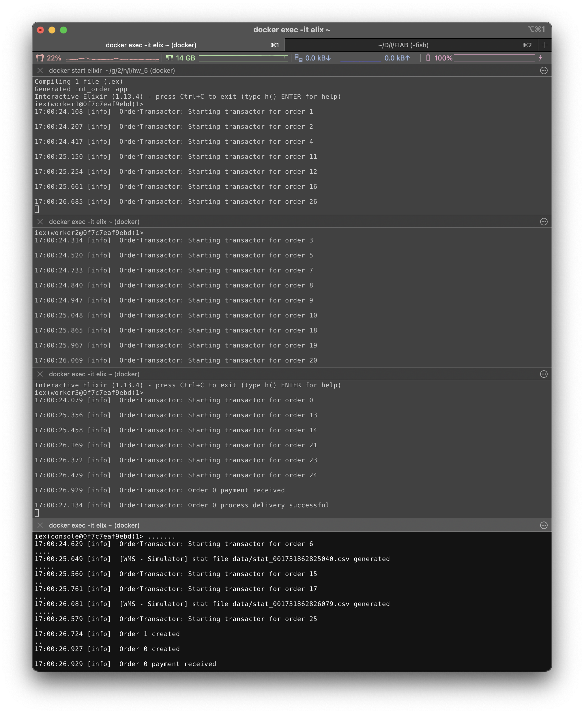

# Phase 3 - Transactions and Error Management Policy

## Introduction

Phase 3 aims to strengthen the management of orders in an Elixir application. This includes ensuring the sequential processing of events related to each order (creation and payment), implementing robust error management, and establishing a distributed architecture to guarantee scalability.

## Main Features

1. **Order Processing with GenServer**:
   - Each order is managed by a dedicated GenServer.
   - Orders are processed sequentially to maintain logical order (creation, payment receipt, and delivery).
2. **Dynamic Supervision**:
   - A `DynamicSupervisor` is used to supervise `OrderTransactor` GenServers.
3. **Error Management**:
   - HTTP requests include a retry mechanism in case of failure (5xx error codes).
   - Integration of an exponential backoff mechanism for recurring failures.
4. **Distributed Architecture**:
   - **`order_dispatcher.ex`**:
     - Contains a GenServer responsible for:
       - Keeping track of the list of nodes and the mapping of transactors to nodes.
       - Balancing the load across available nodes using consistent hashing.
   - **`order_manager.ex`**:
     - Contains a GenServer responsible for:
       - Launching `OrderTransactor` processes locally on the node upon request from the dispatcher.
       - Periodically attempting to connect to the "console" node (the main node with the simulator) to allow additional nodes to be started before the console.
   - **`order_transactor.ex`**:
     - Contains the logic for the transactors, including:
       - Starting, handling, and managing the lifecycle of each `OrderTransactor`.
       - Ensuring the sequential processing of commands such as `:new` for creation and `:payment` for payment handling.
       - Implementing retry logic for HTTP requests and exponential backoff for resilience in the event of repeated failures.

## Instructions for Execution

The main node that runs the simulator must be called `console` otherwise the simulation isn't launched.

1. Launch with only the simulator

```bash
iex --sname console -S mix
```

2. Launch with the simulator and 3 worker nodes

```bash
iex --sname worker1 -S mix
iex --sname worker2 -S mix
iex --sname worker3 -S mix
iex --sname console -S mix
```

## Screenshot

Screenshot with the simulator and 3 workers running


