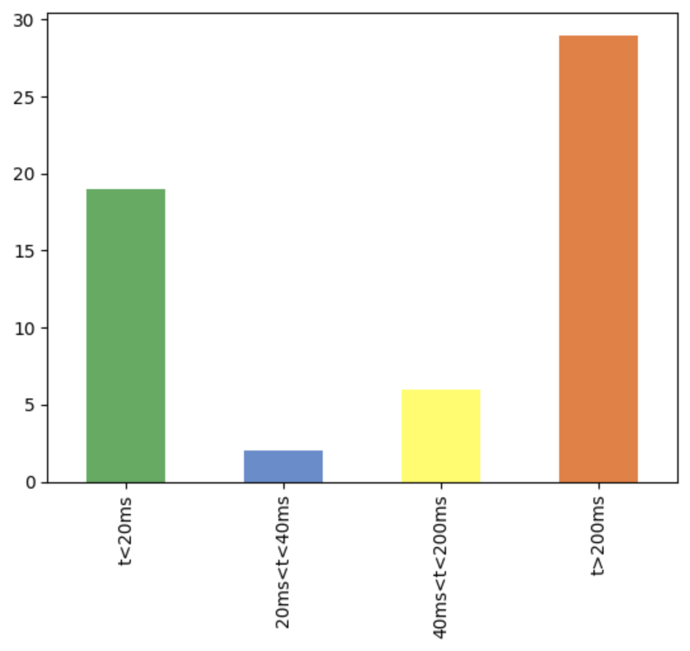
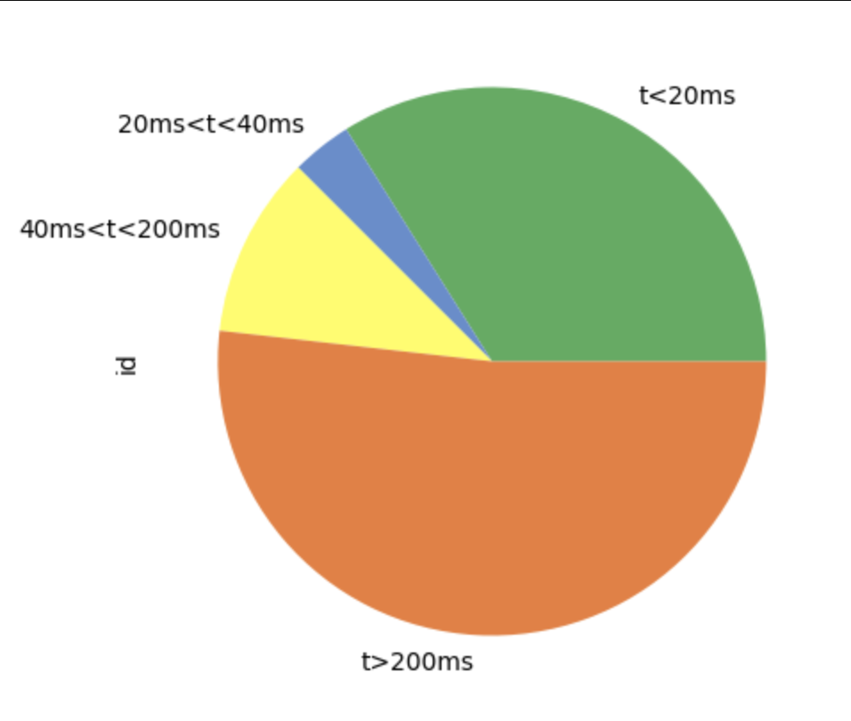
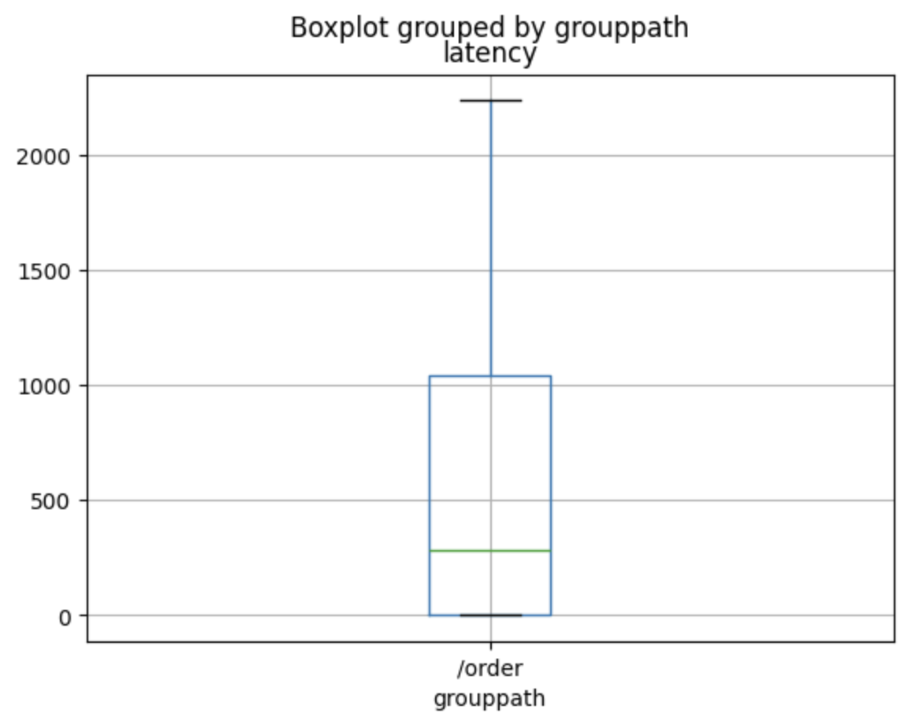
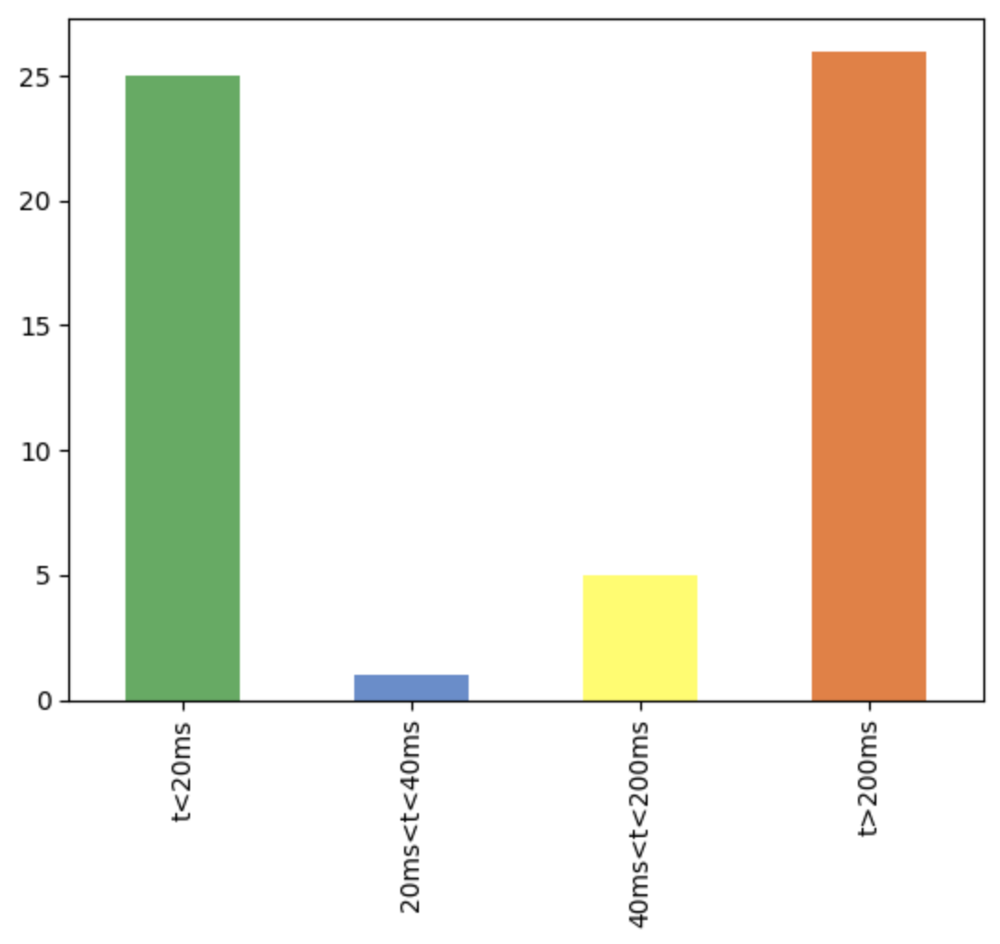
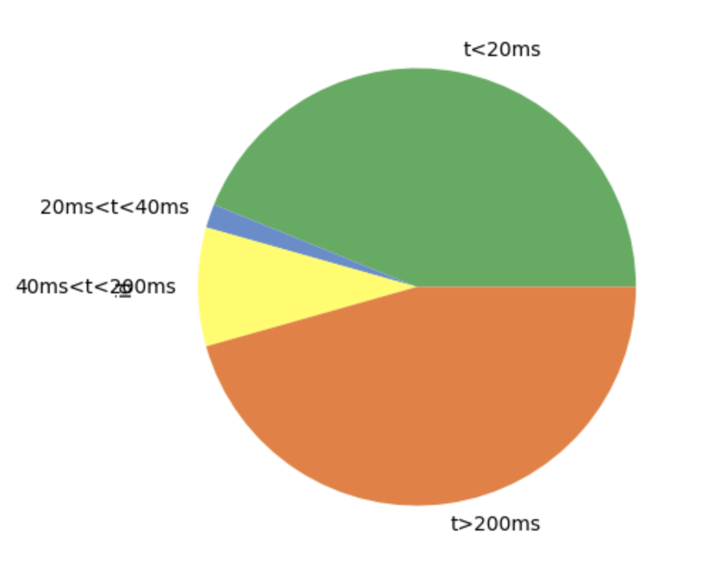
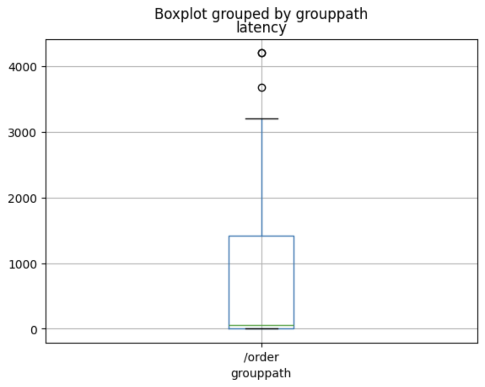

# Phase 4 - Fully distributed architecture and load balancing

## Introduction

Phase 4 builds upon the foundations established in previous phases, culminating in a robust, distributed system with advanced features for scalability, fault tolerance, and efficiency. This document outlines the process undertaken to achieve the fully functional version of the project, the architectural improvements, and instructions for deploying the system.

## Introduced new dependency

```
{:libring, "~> 1.0"}
```

## Key Features in Phase 4

1. **Distributed architecture with DistMix**

   - Nodes are categorized into roles:
     - Front Node, Load Balancer, API Nodes, Data Management Node.
   - Dynamic scalability with DistMix simplifies node addition and removal.

2. **Load balancing**

   - Introduced a round-robin load balancer to evenly distribute HTTP requests among API nodes.

3. **Improved transactor management**

   - Optimized request handling using `handle_continue`.
   - Added timeout-based transactor shutdown.
   - Handled out-of-order payment and order creation scenarios.

4. **Consistent Hashing**

   - Implemented using the `libring` library to improve node scaling and reduce key redistribution.

5. **Replica management**

   - Ensured state synchronization across replicas.
   - Added leader election and failover mechanisms for transactor replicas.

6. **Node monitoring and fault tolerance**
   - Both the dispatcher and transactors monitor nodes for failure and recovery.
   - Automatically updates the hash ring and redistributes transactors as needed.

## Process for achieving the fully functional version

### 1. **Introducing the Load Balancer and restructuring the project**

- A load balancer was introduced to distribute HTTP requests evenly across API nodes using a **round-robin** strategy.
- The project structure was reorganized to separate roles among nodes:
  - **Front Node** for client simulations.
  - **Load Balancer Node** to manage request distribution.
  - **API Nodes** for order processing and transactions.
  - **Stats database Node** for storing and retrieving product-related statistics.
  - **Back Node** for Warehouse Management System (WMS)

### 2. **Implementing an HTTP API for product statistics**

- Created an API to handle HTTP requests for retrieving product-related statistics.
- Enabled a dedicated node for managing statistics using Elixir’s `Plug` and `Cowboy` libraries.

### 3. **First version using a Distributed Hash Table (DHT)**

- Developed a **DHT**-based approach for managing transactors across nodes.
- Identified a critical limitation: when adding or removing nodes, the DHT required redistributing all keys, causing transactors to be reassigned.

### 4. **Adding Consistent Hashing with `libring`**

- Replaced the DHT with **consistent hashing** to solve key redistribution problem.
- Leveraged the `libring` library to minimize transactor redistribution when nodes are added or removed.
- Enhanced scalability by ensuring a smooth transition when scaling the cluster.

### 5. **Improving transactor logic**

- Optimized transactor responsiveness by:
  - Removing intermediate database saves during processing.
  - Using `handle_continue` to process tasks immediately after responding to requests.
- Ensured faster responses to requests while maintaining seamless background processing.

### 6. **Transactor shutdown and timeout logic**

- Addressed errors caused by premature transactor shutdowns by introducing:
  - A **10-second inactivity timeout** to delay transactor termination.
- Improved robustness by ensuring transactors remain active for subsequent requests.

### 7. **Handling payment requests before order creation**

- Added logic to process payment requests that arrive before the corresponding order is created.
- Ensured seamless handling of such cases by temporarily storing payments until the order is available.

### 8. **Managing transactor replicas**

- Introduced functionality to handle replicas of transactors on other nodes:
  - **State Synchronization**: Replicas sync their state with the leader.
  - **Leader Election**: Designated the first live node in the replica list as the leader.
  - **Node Monitoring**: Continuously monitored replica nodes to handle failures and recoveries.

### 9. **Dispatcher enhancements**

- Made the dispatcher more robust by:
  - Implementing **node monitoring** to detect nodes joining or leaving the cluster.
  - Maintaining a record of transactor locations, ensuring accurate state tracking even when nodes leave or rejoin the consistent hash ring.
  - Broadcasting the dispatcher’s state to all other dispatchers in the cluster to ensure consistency.

## Instructions for execution

### Launching the application

1. **Open the project directory**:

   ```bash
   cd /mnt/project
   ```

2. **Add the project to the system path for DistMix**:

   Replace `/mnt/project` with the correct path where the project is located.

   ```bash
   export PATH=$PATH:/mnt/project
   ```

3. **Start `epmd`**:

   ```bash
   epmd &
   ```

4. **Get dependencies and compile**

   ```bash
   make deps
   ```

5. **Clean data directory**

   ```bash
   make clean
   ```

6. **Launch the project with 8 nodes**

   ```bash
   iex -S distmix 8
   ```

   This command will launch the following nodes:

   - The load balancer
   - The back node
   - The stats database node
   - 3 API + Transactor nodes
   - The simulation node

## Results

### Without any node failures

When analyzing the graphs, we observe that the consistent **10% error rate** caused by transactors shutting down while messages were still in the queue has been successfully resolved. The improvements in transactor lifecycle management and error handling have significantly enhanced system reliability.

Additionally, we can see that the latencies are relatively high, which is expected due to the distributed nature of the architecture. Communication between nodes and the distributed processing introduces overhead, but this is balanced by the scalability and fault tolerance benefits.

#### Visualizations:

1. **Latency distribution**:

   - Shows the distribution of latency across different time ranges, with most requests processed within acceptable latency thresholds.

   

2. **Latency proportions**:

   - Illustrates the proportions of requests within specific latency ranges, emphasizing that the majority fall into efficient processing times.

   

3. **Latency box plot**:

   - Highlights the variability and median latency, indicating low outliers and manageable upper bounds.

   

### With node failures

The system demonstrates reliability and robustness even under dynamic conditions. The consistent hashing and transactor replica management ensure that requests are handled effectively, maintaining system integrity.

#### Visualizations:

1. **Latency distribution**:

   - Shows the distribution of latency across different time ranges, with most requests processed within acceptable latency thresholds.

   

2. **Latency proportions**:

   - Illustrates the proportions of requests within specific latency ranges, emphasizing that the majority fall into efficient processing times.

   

3. **Latency box plot**:

   - Highlights the variability and median latency, indicating low outliers and manageable upper bounds.

   

## Proposed improvements

### 1. Dynamic node discovery

- **Current limitation**: The load balancer uses a static list of nodes, making it difficult to handle new nodes dynamically.
- **Improvement**:
  - Introduce a **discovery service** where nodes register upon joining or leaving.
  - The load balancer queries this service to dynamically update the list of active API nodes.
- **Impact**: Simplifies cluster scaling and ensures the system adapts to changes seamlessly.

### 2. Improved Load Balancer for node health awareness

- **Current limitation**: The round-robin strategy in the load balancer doesn't account for node health or performance.
- **Improvement**:
  - Add a **health check mechanism** to avoid routing requests to unhealthy or unreachable nodes.
  - Implement a **weighted round-robin** strategy to balance the load based on node capacity or performance metrics.
- **Impact**: Improves reliability and ensures optimal request distribution, especially in scenarios with uneven load or partial failures.

### 3. Enhanced fault tolerance for transactors

- **Current limitation**: Transactors shut down after 10 seconds of inactivity, but there’s no mechanism for recovering partial state after shutdown.
- **Improvement**:
  - Add **checkpointing** to periodically save transactor states during operation.
  - Enable transactors to recover from the last saved checkpoint when restarted.
- **Impact**: Increases fault tolerance and ensures seamless recovery in case of failures or restarts.

### 4. Handling partitioning in the hash ring

- **Current limitation**: Each dispatcher maintains its own view of reachable nodes, but there’s no fallback logic for handling node partitioning effectively.
- **Improvement**:
  - Add partition-handling logic to allow nodes to temporarily act as leaders in their own partitions.
  - Synchronize changes when partitions heal to ensure consistency across the system.
- **Impact**: Ensures continuity of operations during network partitions and minimizes disruption.
